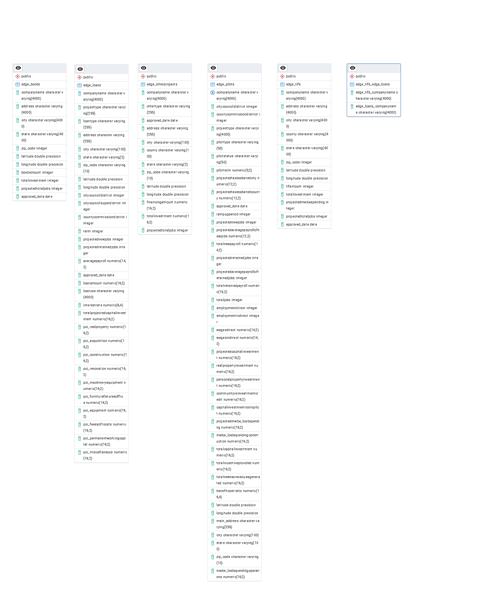

# Data Model (ERD)

This diagram shows the final PostgreSQL schema used for the Memphis EDGE incentive analysis project. It illustrates how the cleaned datasets relate to one another and how they support the SQL queries used in the analysis.

